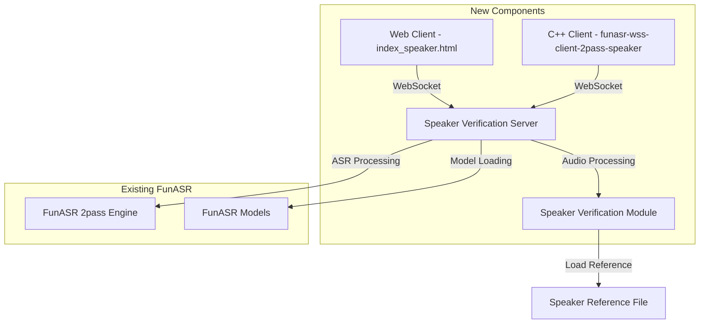
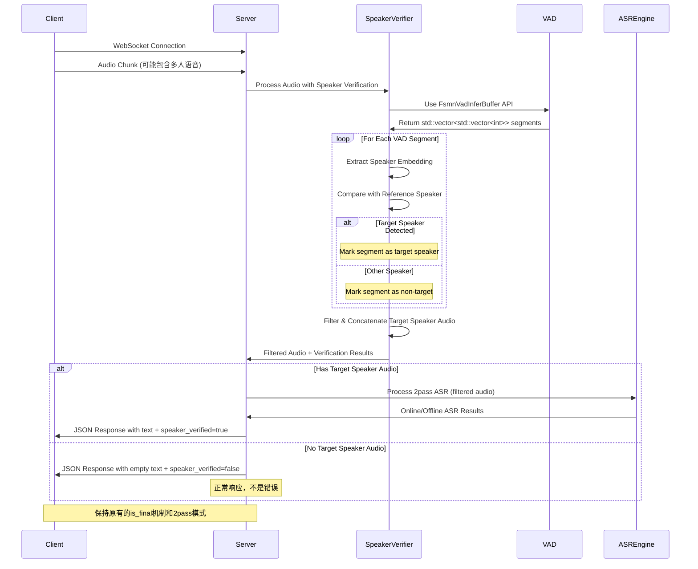

# Design Document

## Overview

本设计文档描述了基于 FunASR 官方 `funasr-wss-server-2pass` 的说话人验证语音识别系统。系统通过创建新的服务器、客户端和 Web 界面文件，在不修改原有代码的基础上，实现对特定说话人的语音识别功能。

## Architecture

### 系统架构图



### 组件关系

1. **新的服务器组件** (`funasr-wss-server-2pass-speaker`) 继承原有服务器功能
2. **说话人验证模块** 在 ASR 处理前进行身份验证
3. **新的客户端和 Web 界面** 专门连接到新服务器
4. **复用现有 FunASR 引擎** 进行实际的语音识别处理

## Components and Interfaces

### 1. 说话人验证服务器 (funasr-wss-server-2pass-speaker.cpp)

#### 核心功能

- 继承原有 `funasr-wss-server-2pass` 的所有功能
- 集成说话人验证模块
- 支持新的启动参数

#### 新增参数

```cpp
// 新增命令行参数
--speaker-file <path>           // 预注册说话人的 WAV 文件路径
--spk-threshold <float>         // 说话人验证阈值 (默认: 0.5)
--enable-speaker-verification   // 启用说话人验证 (默认: false)
```

#### 处理流程



### 2. 说话人验证模块

#### 模型选型

基于 FunASR 生态系统中的说话人相关模型：

1. **说话人特征提取模型**:
   - 使用 `damo/speech_campplus_sv_zh-cn_16k-common` 提取说话人嵌入向量
   - 支持 16kHz 采样率的中文语音
   - 输出 192 维的说话人特征向量

2. **音频分割策略**:
   - 复用现有的 VAD 模型 `damo/speech_fsmn_vad_zh-cn-16k-common-onnx`
   - 使用滑动窗口（2-3秒）进行音频分段
   - 确保每个分段包含足够的语音信息用于说话人识别

#### 接口设计

```cpp
// 复用FunASR现有的VAD结果格式：std::vector<std::vector<int>>
// 每个内部vector包含 [start_time_ms, end_time_ms]
// 扩展结构用于说话人验证
struct SpeakerSegmentInfo {
    int start_time_ms;      // 开始时间（毫秒）
    int end_time_ms;        // 结束时间（毫秒）
    bool is_target_speaker; // 是否为目标说话人
    float confidence;       // 验证置信度
};

class SpeakerVerifier {
public:
    // 初始化验证器，加载参考说话人音频和模型
    bool Initialize(const std::string& speaker_file, 
                   const std::string& sv_model_path,
                   float threshold);
  
    // 对音频进行说话人分割和验证（处理多人音频）
    std::vector<SpeakerSegmentInfo> ProcessAudioWithSpeakerVerification(
        const float* audio_data, int length, int sample_rate);
  
    // 验证单个音频段是否来自目标说话人
    bool VerifySpeaker(const float* audio_data, int length);
  
    // 获取验证置信度
    float GetConfidence() const;
  
    // 过滤并拼接目标说话人的音频段
    std::vector<float> FilterTargetSpeakerAudio(
        const float* audio_data, int length, 
        const std::vector<SpeakerSegmentInfo>& segments);
  
private:
    std::vector<float> reference_embedding_;  // 参考说话人特征向量
    float threshold_;                         // 验证阈值
    void* sv_model_;                         // 说话人验证模型句柄
    
    // 提取说话人特征向量
    std::vector<float> ExtractSpeakerEmbedding(const float* audio_data, int length);
    
    // 计算余弦相似度
    float ComputeCosineSimilarity(const std::vector<float>& emb1, 
                                 const std::vector<float>& emb2);
    
    // 使用现有VAD API进行音频分段
    std::vector<std::vector<int>> SegmentAudioByVAD(const float* audio_data, 
                                                   int length, int sample_rate);
    
    // 将VAD结果转换为说话人验证结果
    std::vector<SpeakerSegmentInfo> ConvertVadToSpeakerSegments(
        const std::vector<std::vector<int>>& vad_segments,
        const float* audio_data, int length, int sample_rate);
};
```

#### 多人音频处理流程

1. **音频分割**: 
   - 使用现有 VAD 模型检测语音活动段
   - 按语音停顿或固定时长（2-3秒）进行分段
   - 确保每个分段有足够长度用于说话人识别
   
2. **说话人验证**: 
   - 对每个音频段提取 192 维说话人特征向量
   - 与参考说话人特征计算余弦相似度
   - 根据阈值判断是否为目标说话人
   
3. **音频过滤与拼接**: 
   - 只保留验证通过的音频段
   - 将通过验证的音频段按时间顺序拼接
   - 拼接后的音频送入 2pass ASR 引擎
   
4. **结果输出**: 
   - 返回目标说话人的识别文本
   - 在响应中标记说话人验证状态和置信度

### 3. 启动脚本 (run_server_2pass_speaker.sh)

#### 配置参数

```bash
# 基于原有脚本的新参数
port=10096  # 使用不同端口避免冲突
speaker_file=""  # 说话人参考文件路径
spk_threshold=0.5  # 验证阈值
enable_speaker_verification=1  # 启用说话人验证

# 说话人验证模型配置
sv_model_dir="damo/speech_campplus_sv_zh-cn_16k-common"  # 说话人验证模型

# 新的可执行文件
cmd=funasr-wss-server-2pass-speaker
```

#### 启动命令

```bash
$cmd_path/${cmd} \
  --download-model-dir "${download_model_dir}" \
  --model-dir "${model_dir}" \
  --online-model-dir "${online_model_dir}" \
  --vad-dir "${vad_dir}" \
  --punc-dir "${punc_dir}" \
  --itn-dir "${itn_dir}" \
  --lm-dir "${lm_dir}" \
  --sv-model-dir "${sv_model_dir}" \
  --decoder-thread-num ${decoder_thread_num} \
  --model-thread-num ${model_thread_num} \
  --io-thread-num ${io_thread_num} \
  --port ${port} \
  --certfile "${certfile}" \
  --keyfile "${keyfile}" \
  --hotword "${hotword}" \
  --speaker-file "${speaker_file}" \
  --spk-threshold ${spk_threshold} \
  --enable-speaker-verification ${enable_speaker_verification} &
```

### 4. 客户端 (funasr-wss-client-2pass-speaker.cpp)

#### 新增功能

- 支持连接到说话人验证服务器
- 处理说话人验证失败的响应
- 支持测试不同说话人的音频文件

#### 消息格式扩展

基于原有的响应格式，新增说话人验证相关字段：

```json
// 说话人验证通过时的正常响应（保持原有格式）
{
  "text": "识别的语音文本内容",
  "mode": "2pass-online",  // 或 "2pass-offline"
  "wav_name": "audio_file_name",
  "is_final": false,       // 或 true
  "speaker_verified": true,     // 新增：说话人验证状态
  "speaker_confidence": 0.85    // 新增：验证置信度
}

// 说话人验证失败时的响应
{
  "text": "",              // 空文本，因为验证失败
  "mode": "2pass-online",
  "wav_name": "audio_file_name", 
  "is_final": false,
  "speaker_verified": false,    // 验证失败
  "speaker_confidence": 0.3,    // 低置信度
  "verification_message": "Speaker verification failed"  // 失败原因
}

// 最终结果响应（验证通过）
{
  "text": "完整的识别结果文本",
  "mode": "2pass-offline",
  "wav_name": "audio_file_name",
  "is_final": true,
  "speaker_verified": true,
  "speaker_confidence": 0.92
}
```

### 5. Web 界面 (index_speaker.html)

#### 界面设计

- 基于原有 `index.html` 的布局
- 新增说话人验证状态显示
- 修改默认连接地址为新服务器端口

#### 新增 UI 元素

```html
<!-- 说话人验证状态显示 -->
<div id="speaker_status_div" style="border:2px solid #ccc;">
    说话人验证状态: <span id="speaker_status">未连接</span><br>
    验证置信度: <span id="speaker_confidence">--</span>
</div>

<!-- 修改默认服务器地址 -->
<input id="wssip" type="text" value="wss://127.0.0.1:10096/"/>
```

#### JavaScript 功能扩展

```javascript
// 处理说话人验证响应
function handleSpeakerVerification(jsonData) {
    if (jsonData.speaker_verified !== undefined) {
        document.getElementById('speaker_status').textContent = 
            jsonData.speaker_verified ? '验证通过' : '验证失败';
        document.getElementById('speaker_confidence').textContent = 
            jsonData.speaker_confidence || '--';
    }
}
```

## Data Models

### 音频数据处理

复用现有的 `funasr::Audio` 类进行音频数据处理：
```cpp
// 使用现有的 funasr::Audio 类
// 位于 samples/cpp/websocket_client/include/audio.h
namespace funasr {
    class Audio {
        // 已有的音频加载和处理功能
        bool LoadWav(const char* filename, int32_t* sampling_rate, bool resample=true);
        int Fetch(float *&dout, int &len, int &flag);
        char* GetSpeechChar();
        int GetSpeechLen();
        // ... 其他现有方法
    };
}
```

### 说话人验证结果

```cpp
struct SpeakerVerificationResult {
    bool verified;         // 验证是否通过
    float confidence;      // 置信度 [0.0, 1.0]
    std::string message;   // 附加信息
};
```

### WebSocket 消息扩展

```cpp
// 在原有消息基础上扩展
struct WSMessage {
    // 原有字段...
    std::string mode;
    std::string text;
    bool is_final;
  
    // 新增字段
    bool speaker_verified;
    float speaker_confidence;
    std::string verification_message;
};
```

## Error Handling

### 错误类型和处理策略

1. **说话人文件加载错误**

   - 检查文件路径和格式
   - 提供详细错误信息
   - 优雅降级到普通 ASR 模式
2. **说话人验证模型加载失败**

   - 检查模型文件完整性
   - 提供模型路径配置选项
   - 记录详细错误日志
3. **音频格式不兼容**

   - 支持常见音频格式转换
   - 提供格式要求说明
   - 返回明确的格式错误信息
4. **网络连接错误**

   - 实现重连机制
   - 提供连接状态反馈
   - 支持连接超时配置

### 说话人验证失败处理

**重要**: 说话人验证失败不是系统错误，而是正常的业务逻辑结果。

#### 正常响应格式（验证失败时）
```json
{
  "text": "",                    // 空文本，因为没有目标说话人语音
  "mode": "2pass-online",
  "wav_name": "audio_file_name",
  "is_final": false,
  "speaker_verified": false,     // 验证失败
  "speaker_confidence": 0.3,     // 低置信度
  "verification_message": "No target speaker detected in this audio segment"
}
```

#### 真正的错误响应格式（系统错误）
```json
{
  "error": true,
  "error_code": "SPEAKER_MODEL_LOAD_FAILED",
  "error_message": "Failed to load speaker verification model",
  "details": {
    "model_path": "/path/to/speaker/model"
  }
}
```

## Testing Strategy

### 单元测试

1. **说话人验证模块测试**

   - 测试特征提取功能
   - 测试相似度计算准确性
   - 测试阈值边界条件
2. **WebSocket 协议测试**

   - 测试消息格式兼容性
   - 测试连接建立和断开
   - 测试并发连接处理

### 集成测试

1. **端到端功能测试**

   - 测试完整的音频处理流程
   - 测试说话人验证和 ASR 集成
   - 测试 Web 界面交互
2. **性能测试**

   - 测试说话人验证延迟
   - 测试并发用户处理能力
   - 测试内存和 CPU 使用情况

### 测试数据

1. **正面测试用例**

   - 目标说话人的多段音频
   - 不同音质和长度的音频
   - 不同噪声环境下的音频
2. **负面测试用例**

   - 非目标说话人的音频
   - 混合多人语音
   - 纯噪声或静音

### 测试环境

```bash
# 测试脚本示例
./test_speaker_verification.sh \
  --server-port 10096 \
  --speaker-file test_data/target_speaker.wav \
  --test-audio-dir test_data/audio_samples/ \
  --expected-results test_data/expected.json
```

## Performance Considerations

### 优化策略

1. **说话人验证优化**

   - 使用轻量级特征提取模型
   - 实现特征缓存机制
   - 优化相似度计算算法
2. **内存管理**

   - 复用音频缓冲区
   - 及时释放临时数据
   - 控制并发连接数量
3. **计算资源分配**

   - 说话人验证和 ASR 处理并行化
   - 合理分配 CPU 线程
   - 优化 GPU 资源使用

### 性能指标

- 说话人验证延迟: < 100ms
- ASR 处理延迟: 保持原有性能
- 内存占用增量: < 200MB
- 并发连接支持: > 50 个连接
