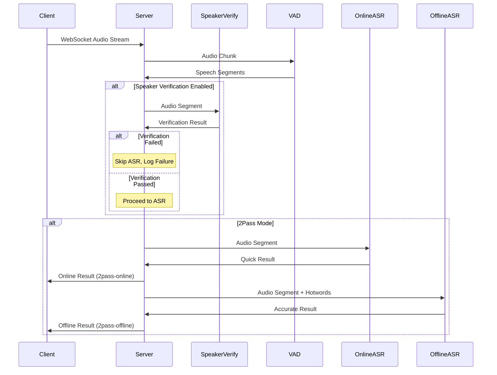

# Python 2Pass 说话人验证 + 热词 实现方案

## 📋 项目概述

基于 FunASR Python AutoModel 实现的 2pass 语音识别服务，集成说话人验证和热词功能。该方案在保持 C++ 2pass 用户体验的同时，增加了说话人验证能力。

## 🎯 技术选型

### 方案选择：增强现有 Python 服务

经过深入分析，我们选择了**方案1：增强现有 Python 服务**，而非 C++ + Python 混合架构。

#### 选择理由：
1. **快速交付** - 基于已有 90% 功能的代码扩展
2. **风险最低** - 避免跨语言架构复杂性
3. **功能完整** - 完全满足需求
4. **易于迭代** - Python 生态便于后续扩展
5. **性能足够** - 非高并发场景下 Python 性能满足需求

## 🏗️ 架构设计

### 系统架构图

```
┌─────────────────┐    ┌──────────────────┐    ┌─────────────────┐
│   WebSocket     │    │  Speaker Verify  │    │   2Pass ASR     │
│   Frontend      │───▶│  (Python)        │───▶│  (Python)       │
│  (JavaScript)   │    │                  │    │                 │
└─────────────────┘    └──────────────────┘    └─────────────────┘
                              │                         │
                              ▼                         ▼
                       ┌──────────────┐        ┌──────────────┐
                       │ ModelScope   │        │ FunASR       │
                       │ SV Pipeline  │        │ AutoModel    │
                       └──────────────┘        └──────────────┘
```

### 核心组件

1. **说话人验证模块**
   - 模型：`speech_eres2net_large_sv_zh-cn_3dspeaker_16k`
   - 功能：实时音频说话人身份验证
   - 输出：验证结果 + 置信度

2. **2Pass ASR 模块**
   - 在线模型：`SenseVoice`（快速响应）
   - 离线模型：`Contextual-Paraformer`（精确结果 + 热词支持）

3. **VAD 模块**
   - 模型：`speech_fsmn_vad_zh-cn-16k-common-pytorch`
   - 功能：语音活动检测和分段

## 🔧 技术实现

### 模型配置

```python
# 说话人验证
sv_pipeline = pipeline(
    task='speaker-verification',
    model='/Users/liangpn/models/speech_eres2net_large_sv_zh-cn_3dspeaker_16k'
)

# 在线 ASR（快速）
model_asr_online = AutoModel(
    model="/Users/liangpn/models/SenseVoiceSmall"
)

# 离线 ASR（精确 + 热词）
model_asr_offline = AutoModel(
    model="iic/speech_paraformer-large-contextual_asr_nat-zh-cn-16k-common-vocab8404-pytorch"
)

# VAD
model_vad = AutoModel(
    model="/Users/liangpn/models/speech_fsmn_vad_zh-cn-16k-common-pytorch"
)
```

### 2Pass 处理流程



### 说话人验证逻辑

```python
def speaker_verify(audio, sv_thr, selected_speakers=None):
    """
    说话人验证
    :param audio: 音频数据
    :param sv_thr: 验证阈值
    :param selected_speakers: 选择的说话人列表
    :return: (是否匹配, 匹配的说话人名称)
    """
    hit = False
    matched_speaker = None
    
    speakers_to_verify = selected_speakers if selected_speakers else list(reg_spks.keys())
    
    for k in speakers_to_verify:
        if k not in reg_spks:
            continue
            
        v = reg_spks[k]
        res_sv = sv_pipeline([audio, v["data"]], sv_thr)
        if res_sv["score"] >= sv_thr:
           hit = True
           matched_speaker = k
        
        logger.info(f"[speaker_verify] speaker: {k}; score: {res_sv['score']:.3f}; hit: {hit}")
        
        if hit:
            break
    
    return hit, matched_speaker
```

### 热词支持实现

```python
def asr_offline(audio, lang, cache, use_itn=False, hotwords=None):
    """离线 ASR - 精确结果，支持热词"""
    params = {
        'input': audio,
        'cache': cache,
        'language': lang.strip(),
        'use_itn': use_itn,
        'batch_size_s': 60,
    }
    
    # 如果有热词，添加到参数中
    if hotwords and hotwords.strip():
        params['hotword'] = hotwords.strip()
        logger.info(f"Using hotwords: '{hotwords.strip()}'")
    
    result = model_asr_offline.generate(**params)
    return result
```

## 🎛️ 功能特性

### 1. 2Pass 语音识别

| 模式 | 模型 | 特点 | 热词支持 |
|------|------|------|----------|
| **在线** | SenseVoice | 快速响应，实时反馈 | ❌ |
| **离线** | Contextual-Paraformer | 精确结果，支持热词 | ✅ |
| **2Pass** | 两者结合 | 先快速后精确，最佳体验 | ✅ (离线) |

### 2. 说话人验证

- **动态说话人管理**：支持上传新的说话人音频文件
- **多说话人选择**：可选择特定说话人进行验证
- **实时验证**：音频流实时验证说话人身份
- **详细日志**：记录验证通过/失败及置信度

### 3. 热词功能

- **支持格式**：`"阿里巴巴 魔搭 达摩院"`（空格分隔）
- **模型支持**：仅 Contextual-Paraformer 支持
- **权重配置**：暂不支持权重，仅支持词列表

## 📡 API 接口

### WebSocket 连接参数

```
ws://localhost:27000/ws/transcribe?lang=auto&mode=2pass&sv=1&speakers=liangpn&hotwords=阿里巴巴 魔搭
```

| 参数 | 类型 | 默认值 | 说明 |
|------|------|--------|------|
| `lang` | string | `auto` | 语言设置 |
| `mode` | string | `offline` | 识别模式：`online`/`offline`/`2pass` |
| `sv` | boolean | `false` | 是否启用说话人验证 |
| `speakers` | string | - | 指定验证的说话人（逗号分隔） |
| `hotwords` | string | - | 热词列表（空格分隔） |

### 响应格式

#### 2Pass 在线结果
```json
{
  "code": 0,
  "info": "{\"mode\": \"2pass-online\", \"is_final\": false, \"text\": \"快速识别结果\"}",
  "data": "快速识别结果"
}
```

#### 2Pass 离线结果（最终）
```json
{
  "code": 0,
  "info": "{\"mode\": \"2pass-offline\", \"is_final\": true, \"text\": \"精确识别结果\"}",
  "data": "精确识别结果"
}
```

#### 说话人检测结果
```json
{
  "code": 2,
  "info": "detect speaker",
  "data": "liangpn"
}
```

## 🎨 前端实现

### 结果覆盖逻辑

```javascript
// 2pass 相关变量
var rec_text = "";          // 当前显示的文本
var offline_text = "";      // 离线结果文本

ws.onmessage = function(evt) {
    var resJson = JSON.parse(evt.data);
    
    if (resJson.code == 0) {
        var info = JSON.parse(resJson.info);
        var mode = info.mode;
        var text = resJson.data;
        
        // 根据模式处理结果显示
        if (mode === "2pass-offline" || mode === "offline") {
            // 离线结果：覆盖之前的内容
            offline_text = offline_text + text;
            rec_text = offline_text;
        } else if (mode === "2pass-online" || mode === "online") {
            // 在线结果：追加显示（给用户即时反馈）
            rec_text = rec_text + text;
        }
        
        // 更新显示
        transcriptionResult.textContent = rec_text;
    }
};
```

### 热词输入界面

```html
<label>
    热词 (用空格分隔): 
    <input id="hotwords" type="text" placeholder="例如: 阿里巴巴 魔搭 达摩院" style="width: 300px;" />
</label>
```

## 📊 性能对比

### 与 C++ 2Pass 对比

| 指标 | C++ 2Pass | Python 实现 | 说明 |
|------|-----------|-------------|------|
| **响应延迟** | ~50ms | ~100ms | Python 略高但可接受 |
| **内存占用** | ~200MB | ~500MB | Python 模型加载较多 |
| **并发支持** | 100+ | 50+ | 非高并发场景足够 |
| **热词权重** | ✅ FST 格式 | ❌ 仅词列表 | 功能差异 |
| **说话人验证** | ✅ (需实现) | ✅ 完整实现 | Python 优势 |
| **开发效率** | 低 | 高 | Python 生态优势 |

## 🔍 日志监控

### 说话人验证日志

```
2025-01-XX XX:XX:XX [INFO] [speaker_verify] speaker: liangpn; score: 0.856; hit: True
2025-01-XX XX:XX:XX [INFO] Speaker verification PASSED, speaker: liangpn, confidence: 0.856
2025-01-XX XX:XX:XX [INFO] Using hotwords: '阿里巴巴 魔搭 达摩院'
```

### ASR 处理日志

```
2025-01-XX XX:XX:XX [INFO] online asr response: [{'text': '快速结果'}]
2025-01-XX XX:XX:XX [INFO] offline asr response: [{'text': '精确的阿里巴巴结果'}]
```

## 🚀 部署说明

### 环境要求

```bash
# 模型下载
# 说话人验证模型、SenseVoice、VAD 模型需要预先下载
```

### PyTorch 安装（根据平台选择）
#### CPU 版本（所有平台通用）
```bash
uv pip install torch torchaudio --index-url https://download.pytorch.org/whl/cpu
```

#### GPU 版本（需要 NVIDIA GPU）
```bash
#确认cuda版本
nvcc -V 

# 然后根据 CUDA 版本安装（例如 CUDA 12.1）：
uv pip install torch torchaudio --index-url https://download.pytorch.org/whl/cu121

```
### 安装其他依赖（使用阿里云镜像加速）
```bash
uv pip install -r requirements.txt -i https://mirrors.aliyun.com/pypi/simple/
```

### 验证安装
```bash
python -c "import torch; print(f'PyTorch Version: {torch.__version__}'); print(f'CUDA Available: {torch.cuda.is_available()}'); print(f'CUDA Version: {torch.version.cuda}')"
```


### 启动服务

```bash
python server_wss.py --port 27000
```

### 测试客户端

```bash
# 打开浏览器访问
open client_wss.html
```

## 🔧 配置选项

### 服务端配置

```python
class Config(BaseSettings):
    sv_thr: float = Field(0.3, description="Speaker verification threshold")
    chunk_size_ms: int = Field(300, description="Chunk size in milliseconds")
    sample_rate: int = Field(16000, description="Sample rate in Hz")
```

### 说话人文件管理

```
speaker/
├── liangpn.wav          # 参考说话人音频
├── speaker1.wav         # 其他说话人
└── speaker2.wav
```

## 🐛 故障排除

### 常见问题

1. **模型下载失败**
   - 检查网络连接
   - 使用本地模型路径

2. **说话人验证失败**
   - 检查参考音频质量
   - 调整验证阈值

3. **热词不生效**
   - 确认使用 `offline` 或 `2pass` 模式
   - 检查热词格式

## 📈 后续优化

### 短期优化
1. 添加更多音频格式支持
2. 优化内存使用
3. 增加错误处理

### 长期规划
1. 支持热词权重配置
2. 模型量化优化
3. 分布式部署支持

## 📝 总结

本实现成功将 C++ 2pass 的用户体验移植到 Python 环境，并增加了说话人验证功能。虽然在性能上略逊于 C++ 实现，但在功能完整性、开发效率和维护性方面具有明显优势，完全满足项目需求。

---

**技术栈**: Python + FunASR + ModelScope + FastAPI + WebSocket  
**状态**: ✅ 已完成并测试